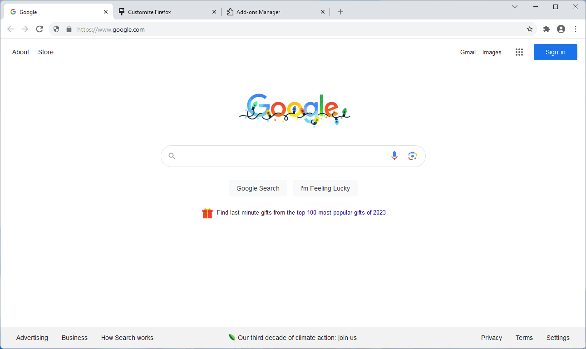

# Chromia

A style looking to mimic Google Chrome (pre 2023 refresh) as closely as possible. Use of either the [Google Chrome Light Theme](https://addons.mozilla.org/en-US/firefox/addon/google-chrome-light/) or [Google Chrome Dark Theme](https://addons.mozilla.org/en-US/firefox/addon/google-chrome-dark/) are recommended for the full experience.

#### :warning: Warning
Colors on the toolbar buttons will appear complete black until you perform the following: head into `about:config`, look for the **svg.context-properties.content.allowed-domains** option, and append `,raw.githubusercontent.com` to the end.

#### Known bugs
- Tab scroller appears prematurely
- Tabs don't smoothly resize while pinned

#### Notes
Not everything will be perfectly replicated due to differences in the browsers and where I was pulling the icons from. The following are missing from this style:
- A few exact icons
- Refresh/Download animations
