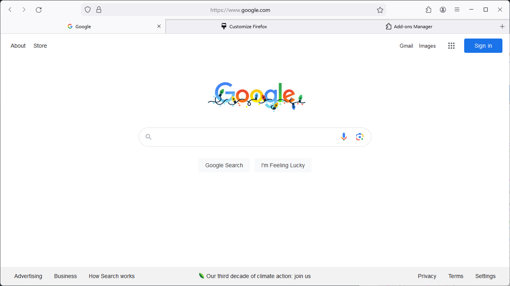

# SfLayout

A style with a Safari-like layout, while retaining a bit of the firefox look (aside from some tuned corner radiuses).

#### :warning: Warning
If you use dark themes, coloring will be broken on the back/forward buttons (they'll appear pure black) as they use custom images, but this can be remedied. Head into `about:config`, look for the **svg.context-properties.content.allowed-domains** option, and append `,raw.githubusercontent.com` to the end. That should fix things up.
